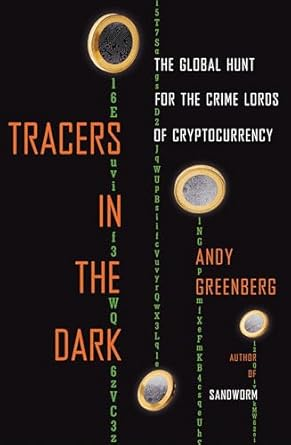

# Tracers in the Dark

*By Andy Greenberg*

The Global Hunt for the Crime Lords of Cryptocurrency

## Summary

A gripping account of how a small team of cybercops and cryptography experts used blockchain technology to expose and take down criminal networks, revealing the dark side of cryptocurrency's assumed anonymity...

## Key Takeaways

- Blockchain's transparency can be used to track criminal activities
- Cryptocurrency transactions leave permanent traces
- Law enforcement has evolved sophisticated tracking methods
- The myth of Bitcoin's perfect anonymity

## Favorite Quotes

> "The blockchain doesn't forget. Every transaction is tracked and traced forever."

## Review

A fascinating deep dive into the world of cryptocurrency forensics, showing how the very technology meant to ensure anonymity became the perfect tool for tracking down criminals... 